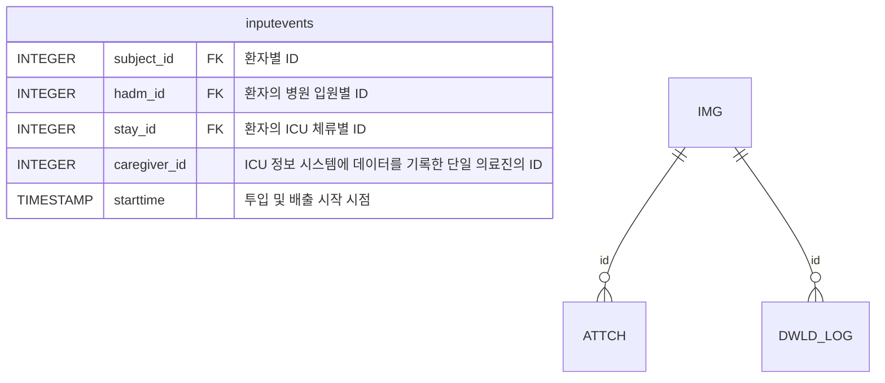

```mermaid

erDiagram
    USER ||--o{ ORDER : "한 회원은 여러 번 주문함"
    ORDER ||--o{ ORDER_ITEM : "한 주문에는 여러 상품이 담김"
    PRODUCT ||--o{ ORDER_ITEM : "한 상품은 여러 주문에 포함됨"

    USER {
        integer user_id PK "회원번호(주인)"
        string name "이름"
        string email "이메일"
    }
    ORDER {
        integer order_id PK "주문번호(주인)"
        integer user_id FK "주문한 회원(연결)"
        datetime order_date "주문일자"
    }
    PRODUCT {
        integer product_id PK "상품번호(주인)"
        string product_name "상품명"
        integer price "가격"
    }
    